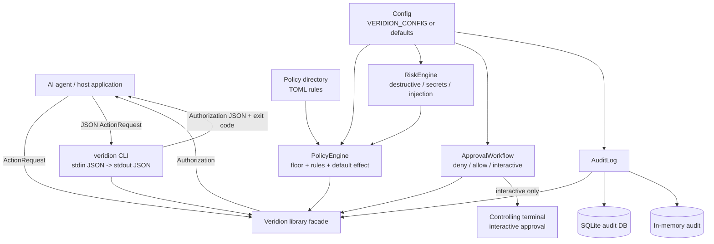
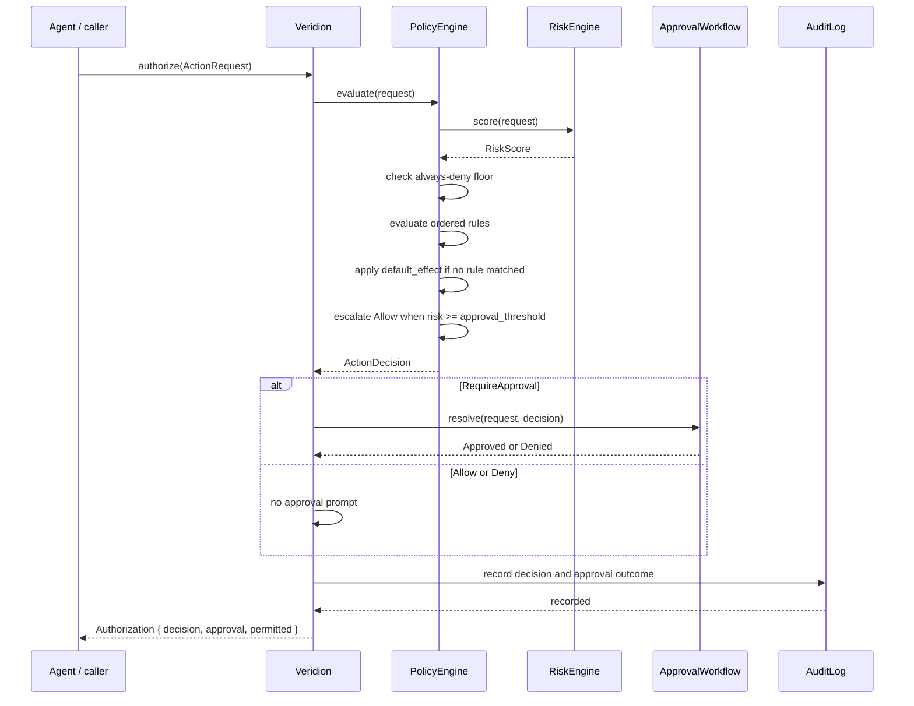
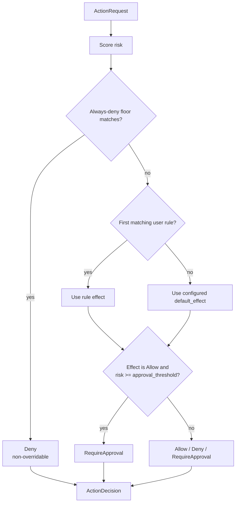

# Architecture

Veridion is a single Rust crate exposing both a library and a thin binary. The
library authorizes AI agent actions: an agent describes an intent as an
`ActionRequest` and the [`Veridion`](../reference/library-api.md) facade decides
whether it may proceed. The `veridion` binary is a stdin/stdout wrapper over that
facade.

## Runtime Architecture



## Module Map

| Module | Responsibility |
|--------|----------------|
| `lib.rs` | Crate root; re-exports the public types |
| `main.rs` | The `veridion` binary: JSON on stdin, `Authorization` on stdout |
| `action.rs` | `ActionRequest`, `Subject`, `Context`, `AttributeValue`, the `actions` verbs |
| `decision.rs` | `ActionDecision`, `Effect`, `RuleRef` |
| `policy.rs` | `PolicyEngine`: rule compilation, the always-deny floor, evaluation, risk escalation |
| `risk.rs` | `RiskEngine` and the built-in `RiskAnalyzer`s |
| `approval.rs` | `ApprovalWorkflow` and the `Approver` implementations |
| `audit.rs` | `AuditLog` (in-memory or SQLite) and `AuditRecord` |
| `engine.rs` | `Veridion` facade and `Authorization` |
| `config.rs` | Typed configuration and TOML loading with defaults |
| `telemetry.rs` | `tracing` subscriber initialization |

## The Veridion Facade

`Veridion` composes three subsystems and owns nothing else:

```rust
pub struct Veridion {
    policy: PolicyEngine,       // rules + floor + risk + escalation
    approval: ApprovalWorkflow, // resolves RequireApproval decisions
    audit: AuditLog,            // records every authorize() call
}
```

`Veridion::from_config` builds all three from a `Config`:

```
Config
 ├─ PolicyEngine::from_config   (load policy_dir, wire risk analyzers)
 ├─ ApprovalWorkflow::from_config (auto_deny | auto_approve | interactive)
 └─ AuditLog::from_config        (memory | sqlite, async)
```

`Veridion::new(policy, approval, audit)` assembles the same object from parts —
the path taken by tests and embedders that want explicit rules.

## The `authorize` Lifecycle

`authorize(&ActionRequest)` runs the full workflow and returns an
`Authorization`:



`evaluate(&ActionRequest)` exposes step 1 alone: a pure `ActionDecision` with no
approval prompt and no audit write.

## Policy Evaluation Flow



## Evaluation Model (`PolicyEngine::evaluate`)

The decision is produced in a fixed order; each stage can short-circuit:

1. **Risk scoring.** The `RiskEngine` runs every configured `RiskAnalyzer` and
   sums their weighted `RiskSignal`s into a `RiskScore` (0–100, saturating). Risk
   is available to every later stage.
2. **Always-deny floor.** A fixed set of catastrophic-command patterns
   (`floor_rm_root`, `floor_rm_home`, `floor_mkfs`, `floor_raw_disk_write`,
   `floor_fork_bomb`, priority `u32::MAX`) is checked first. A match denies
   immediately and cannot be overridden by any rule, approval, or default.
3. **Ordered user rules.** Rules are sorted by priority (descending, then name).
   The first rule whose conditions all match returns its effect.
4. **Default effect.** When no rule matches, the configured `default_effect`
   applies.
5. **Risk escalation.** Finally, an `allow` (from a rule or the default) is
   upgraded to `require_approval` when `risk.value >= approval_threshold`. The
   floor's deny is never reached by this stage, so it always wins.

## Subsystems

- **`PolicyEngine`** compiles globs and regexes once at load time and holds the
  always-deny floor, the ordered user rules, the default effect, a `RiskEngine`,
  and the approval threshold. `reload` swaps the user rules in place.
- **`RiskEngine`** owns a `Vec<Box<dyn RiskAnalyzer>>`. The built-ins are
  `DestructiveCommandAnalyzer`, `SecretAnalyzer`, `InjectionAnalyzer`, and
  `JailbreakAnalyzer`; embedders can add their own.
- **`ApprovalWorkflow`** wraps one `Box<dyn Approver>`. Built-in approvers are
  `AutoDeny` (headless default), `AutoApprove` (dev), and `StdinApprover`
  (terminal prompt).
- **`AuditLog`** is either an in-memory `Mutex<Vec<AuditRecord>>` or a SQLite
  pool. Records are written after the decision (and any approval) is resolved.

## Current Boundaries

Veridion is a focused authorization library. Notable non-goals and known limits:

- **Heuristic risk.** The risk analyzers are string-level pattern matchers, and
  the always-deny floor is a small regex set. They are a useful backstop, not a
  security boundary; sandboxing and least-privilege still matter.
- **No network layer.** Veridion does not intercept HTTP, proxy LLM traffic, or
  inspect prompts in transit. It authorizes actions an agent chooses to submit.
- **No signing or plugins.** There is no request signing, provenance, or WASM
  policy extension; policies are TOML rules plus the compiled-in analyzers.
- **Advisory, not enforcing.** Veridion returns a decision; the calling agent is
  responsible for honoring it. It gates actions it is asked about, not ones it
  never sees.

## Next Steps

- [Library API](../reference/library-api.md) - Programmatic surface of each module
- [CLI](../reference/cli.md) - The binary over the facade
- [Policy Language](../reference/policy-language.md) - The rules the engine evaluates
